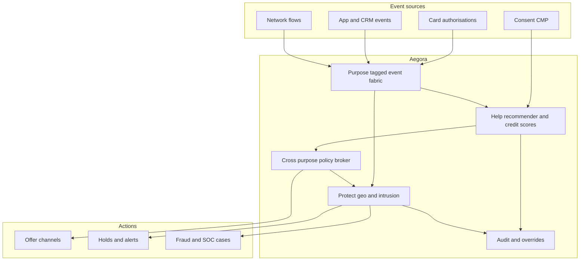

# Aegora

**Source:** `ai-in-financial/ai-in-financenatalia-busa/`
**Domain:** `ai-fin`
**One-liner:** A dual-path retail-banking action plane that personalises next-best financial offers while the same streaming behavioural fabric detects card-theft, geo-anomalies, and network intrusion—so “help the customer” and “protect the customer” share one ethical data contract.
**Wedge:** Mid-to-large retail banks with omnichannel apps (ING-style personal-finance platforms) that already run separate marketing recommenders and fraud stacks and lose both conversion and trust when those systems disagree.
**Positioning:** Help-and-protect customer intelligence, not another generic fraud engine or another product catalogue. Natalino Busa’s thesis is that actionable financial data is ethical only when the bank both proposes/advises/selects *and* detects/prevents/alerts/blocks under the same trust, transparency, and customer-first principles that date back to relationship banking. Aegora productises that twin mandate.

## Market research synthesis

### Thesis from source

The Global Artificial Intelligence Conference talk *AI in Finance: from Hype to marketing and cyber security use cases* reframes AI in banking away from hype decks toward two concrete job families. First, **help**: financial personalised recommenders that are conversational, personal, actionable, and predictive, reusing existing content—illustrated by ING omnichannel platforms that give customers intuitive insights into personal finances, credit pre-authorisation, and fintech lending partnerships (Kabbage for SME automation; WeLab for minute-scale consumer loan approval in China/Hong Kong). Second, **protect**: card-theft geo-alerting via clustering of geolocated events (DBSCAN and convex hulls), streaming machine learning on a Kafka–Cassandra–Spark style fabric, and network intrusion detection over large flow-record corpora (the talk cites ~130 million flow records across ~12,027 hosts over 36 days).

Between those poles sits an ethical frame: data as a relationship—trust, transparency of use, customer first, regulations, respect/protect, and providing a service. Actionable financial data must help (propose, advise, select, filter, connect, simplify) *and* protect (detect, prevent, alert, block, defend, identify, authorize). Technical chapters walk credit-default prediction (Taiwan UCI dataset), shallow vs deep models, semantic clustering of safe vs default cohorts, and the reminder that domain experts plus ML beat tool worship. Takeaways: AI applies in finance; train with domain experts; use all tools and all data—without splitting the customer into a marketing target and a security suspect.

Aegora’s commercial object is therefore a single customer-event fabric with two governed action channels: next-best financial actions that require consent and explainability, and protective interventions that require low-latency alerting and investigator workflow—bound by one purpose-limitation and audit policy so a geo-risk score cannot silently become a marketing exclusion without review.

### Buyer & economic model

- **Primary buyer:** Chief Digital Officer jointly with Head of Fraud/Financial Crime and Head of Retail CRM / Personalisation at a retail bank.
- **Users:** personalisation product managers, relationship managers (offer override), fraud analysts, cyber SOC analysts, model risk officers, privacy officers, customer-care agents handling alert disputes.
- **Budget owner / value metric:** retail P&L (offer conversion and product uptake) plus fraud loss and false-positive cost budgets. Value metrics: incremental verified product uptake from explainable offers; card-fraud loss avoided; false-positive alert rate; time-to-geo-alert; share of protective actions with documented consent/purpose basis.
- **Competing status quo:** siloed marketing decisioning (rules + batch ML) disconnected from real-time fraud engines; SMS blast offers that ignore travel patterns; fraud queues that block legitimate travellers; separate vendors for personalisation and card fraud with no shared event timeline.

### Domain constraints

- **Regulatory / trust / safety:** purpose limitation (marketing vs security processing); PSD2/open-banking and GDPR-style consent; unfair treatment if fraud features leak into credit/offer decisions without policy; model risk for default and fraud scores; customer notification duties for security alerts.
- **Data sensitivity:** transaction streams, device/geo locations, intrusion flow records, credit features; investigators need evidence without exposing full customer dossiers to marketers.
- **Change-management realities:** marketing wants aggressive targeting; fraud wants high recall; privacy wants narrow purpose. Aegora must enforce channel separation with explicit cross-purpose promotion workflows rather than hoping teams “coordinate in Slack.”

## Business requirements

- BR-1: Every customer event must carry a declared processing purpose (help vs protect) before it may trigger an action in either channel.
- BR-2: Next-best financial offers must be explainable at the level of features/segment rationale a relationship manager can defend to a customer.
- BR-3: Protective geo and behavioural alerts must fire within a bank-defined latency SLA for in-scope card events, with investigator-ready context (cluster, hull, prior venues).
- BR-4: Cross-purpose use (e.g. using a fraud risk score to suppress offers) must require a documented policy rule and audit trail—not silent feature reuse.
- BR-5: Credit pre-authorisation and lending offers must separate probability-of-default presentation from binary “credible/not” decisions, matching the source’s risk-management preference for estimated probabilities.
- BR-6: False-positive protective alerts must be measurable and reviewable; customers disputing a block must have a time-boxed resolution path.
- BR-7: Network intrusion and card-geo models must retain training/serving lineage for model-risk review.
- BR-8: Consent and legal basis for personalisation must be queryable before an offer is delivered; absence of basis blocks the help channel without disabling protect.
- BR-9: Domain-expert overrides (RM offer veto; fraud analyst suppress/escalate) must be first-class and counted in KPI dashboards.
- BR-10: The platform must demonstrate that help and protect share a consistent customer identity resolution without merging raw SOC packet data into marketing warehouses.
- BR-11: Period audit exports must show actions taken, purpose, legal basis, and human overrides for regulators and internal audit.
- BR-12: Commercial take-rate or vendor fees for either channel must not create incentives to inflate alerts or spam offers; fee schedules must be transparent to the bank operator.

## User stories

Canonical user stories live in sibling [USER_STORIES.md](USER_STORIES.md).

## System design

### Overview

Aegora ingests banking events (transactions, app sessions, card authorisations, network flows) into a purpose-tagged event fabric. A help engine scores next-best financial actions under consent gates; a protect engine runs geo-behavioural and intrusion detectors that open cases and optional provisional holds. A policy broker mediates any cross-channel influence. Humans override offers and adjudicate alerts; audit exports bind both paths.

### Actors & boundaries

- **Actors:** customers (indirect), personalisation teams, RMs, fraud/SOC analysts, care agents, privacy and model-risk officers, platform operators.
- **Trust boundary:** marketing systems never receive raw intrusion packet detail; protect systems receive only the identity and risk features allowed by policy; customers see offer explanations and alert notices, not internal model weights.
- **Human-in-the-loop points:** offer approval thresholds; provisional-hold confirmation/release; cross-purpose policy changes; model promotion to production.

### Core capabilities

1. **Purpose-tagged event fabric** — identity resolution and purpose labels on streams.
2. **Help: next-best financial actions** — recommenders, credit pre-auth scores, content reuse.
3. **Protect: geo-behavioural card defence** — clustering, alerting, provisional holds.
4. **Protect: network intrusion cases** — flow anomaly detection and investigation packs.
5. **Consent and legal-basis gating** — blocks help without basis; never silently disables protect.
6. **Cross-purpose policy broker** — explicit rules for feature/action reuse across channels.
7. **Human override and dispute** — RM and analyst actions with reason codes.
8. **Model lineage and promotion** — registry for help/protect models.
9. **Audit and period export** — regulator-ready action histories.

### Conceptual data

- **Primary entities:** Customer, Event, PurposeTag, ConsentRecord, Offer, OfferExplanation, CreditScoreSnapshot, GeoCluster, ProtectAlert, ProvisionalHold, IntrusionCase, PolicyRule, ModelVersion, Override, Dispute, AuditExport.
- **Critical events:** event ingested, offer ranked/delivered/blocked, alert raised, hold placed/released, intrusion case opened, override recorded, dispute resolved, model promoted.
- **Retention / audit needs:** action and purpose logs retained for regulatory and dispute windows; raw network flows retained under security policy with shorter windows; marketing features purged on consent withdrawal without erasing protect audit minima required by law.

### Integrations (conceptual)

- **Systems of record:** core banking / cards authorisation, CRM and content management, fraud case management, SIEM/SOC tooling, consent management platform.
- **Upstream signals:** card authorisations, app geolocation (consented), transaction streams, network flow collectors, credit bureau/feature stores.
- **Downstream actions:** offer delivery in app/web, SMS/push security alerts, authorisation decline/hold instructions, case creation in fraud/SOC systems, CRM suppression lists under policy.

### High-level architecture

### Success metrics

- **Leading:** % offers with consent basis present; median geo-alert latency; false-positive rate on provisional holds; % actions with purpose tags; override rate by channel.
- **Lagging:** incremental product uptake from help channel; card fraud loss rate; customer complaint rate on blocks; audit findings on purpose leakage; time-to-resolve disputed holds.

## OpenAPI skeleton

Canonical HTTP surface lives in sibling [openapi.yaml](openapi.yaml). Summary:

- **Base path:** `/v1/...`
- **Auth:** `X-API-Key` for event ingestion and action callbacks; Bearer JWT for operators and analysts.
- **Resource groups:** Events, Offers, Alerts, Holds, Cases, Policies, Models, Audits.
