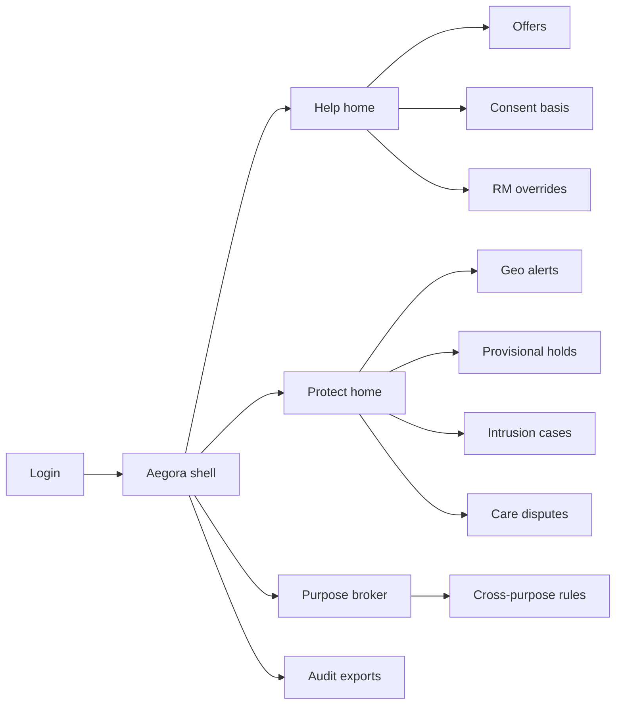
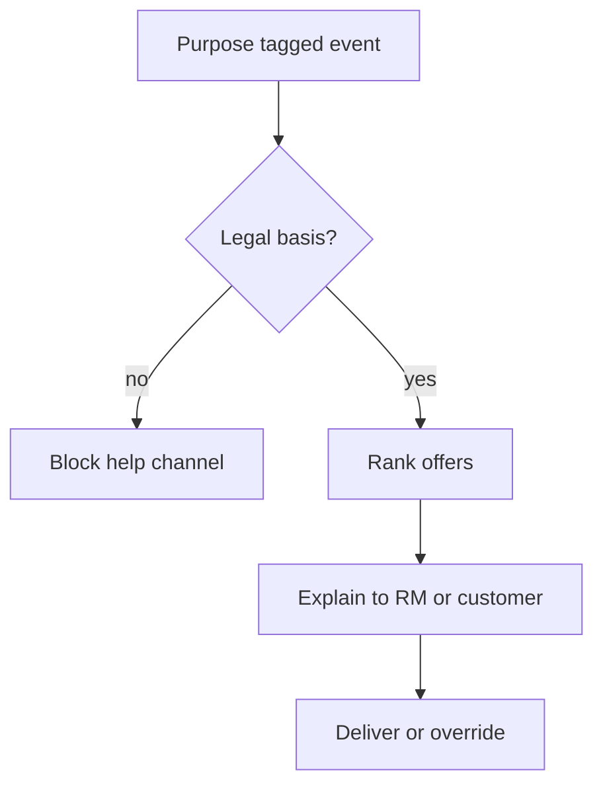
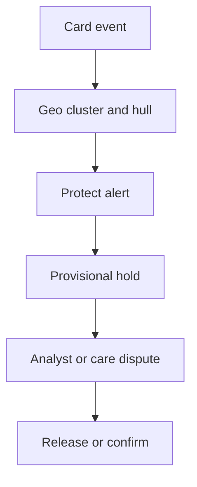

# Aegora — Web app

**Product:** [PRODUCT.md](./PRODUCT.md)
**Primary surface:** Dual-channel retail action plane (Help workspace + Protect workspace under one Aegora shell with a shared purpose broker)
**Secondary surfaces:** Customer care dispute desk (bounded); period purpose-audit export viewer (read-only)
**Design thesis:** Aegora is a twin-mandate relationship desk—help the customer and protect the customer on one ethical contract—not a marketing cloud bolted to a fraud queue. The metaphor is a split ledger book: left page teal “help” (offers, consent, RM voice), right page ember “protect” (geo hulls, holds, SOC cases), bound by a shared spine of purpose tags. Cross-purpose reuse never happens silently; it appears as a signed policy ribbon between pages. The Aegora wordmark sits on the spine so teams never mistake a channel for the whole bank.

## UX research synthesis

### Category peers (best-in-class)

- **ING Personal Banking / PFM experiences:** Omnichannel next-best insights that feel advisory, not spam. Steal: content-reuse recommenders with explainable rationale for RMs (BR-2); reject growth-hack “nudge walls.”
- **Featurespace / Feedzai geo-behavioural consoles:** Travel vs cloning via clusters and investigator context. Steal: geo-cluster + convex-hull anomaly packs with latency SLA (BR-3); reject marketing-exclusion driven by silent fraud scores.
- **OneTrust / consent UX patterns:** Legal basis queryable before delivery. Steal: deny-by-default for help when basis missing while protect continues (BR-8).
- **Salesforce Financial Services Cloud (RM desktop):** Relationship override with reason codes. Steal: RM offer veto and protect-hold awareness before pitch (BR-9); reject CRM as the fraud case system of record.

### Patterns to adopt / reject

- **Adopt:** Dual home (Help vs Protect); purpose tag on every event/action; consent gate on offers; geo-alert investigator packs; cross-purpose policy broker with audit; dispute path for holds; PD as probability not binary credibility theatre.
- **Reject:** Single merged “customer score” dashboard; Aegira-only case clone without help channel; Lendora credit decisioning as core; silent fraud→offer suppression; SOC packet dumps in marketing views.

### Trust, density, and workflow constraints from PRODUCT.md

Marketing wants targeting; fraud wants recall; privacy wants narrow purpose—Aegora enforces channel separation with explicit cross-purpose workflows (BR-4). Identity resolution is shared without merging raw SOC packets into marketing warehouses (BR-10). Fee schedules must not incentivise alert inflation or offer spam (BR-12).

## Information architecture

### Nav model

### Roles → default home

| Role | Default home | Why |
|------|--------------|-----|
| Personalisation PM | Help home — ranked offers + block reasons | Conversion under constraints |
| Relationship manager | RM offer desk | Override + protect-hold awareness |
| Fraud analyst | Geo alerts queue | Travel vs cloning (BR-3) |
| SOC analyst | Intrusion cases | Flow evidence packs |
| Privacy officer | Purpose broker + audits | Purpose limitation (BR-1, BR-11) |
| Customer care | Care disputes | Time-boxed hold resolution (BR-6) |

### Cross-links to OpenAPI resources

| Nav area | OpenAPI tags / resources |
|----------|---------------------------|
| Event fabric / purpose | Events |
| Next-best actions | Offers |
| Geo / behavioural alerts | Alerts |
| Provisional holds | Holds |
| Fraud / SOC investigation | Cases |
| Cross-purpose rules | Policies |
| Help/protect model registry | Models |
| Period regulator exports | Audits |

## Screen inventory

### Help home

- **Purpose:** Rank next-best financial actions with predicted uptake and constraint flags (travel, fraud holds, consent gaps).
- **Entry:** Personalisation PM default.
- **Layout regions:** Teal help chrome; ranked offer table; constraint flag strip; blocked-by-policy itemisation; content-reuse status.
- **Primary actions:** Open offer; fix consent gap; suppress under policy; export uptake forecast.
- **Empty / loading / error:** Empty = connect content objects + consent CMP; error = fabric lag banner.
- **BR / story ties:** BR-2, BR-8; personalisation PM stories.

### Offer detail and explanation

- **Purpose:** Defend an offer to a customer with segment/feature rationale; show PD as probability when credit-adjacent.
- **Entry:** Help home; RM deep link.
- **Layout regions:** Offer content; explanation panel; consent/legal basis chip; PD probability meter (not binary badge); protect-hold warning if active.
- **Primary actions:** Deliver; hold for RM; override; block if basis missing.
- **Empty / loading / error:** Missing basis = hard block help only (BR-8).
- **BR / story ties:** BR-2, BR-5, BR-8.

### RM override desk

- **Purpose:** Soften/veto automated offers with reason codes; see active protect holds before pitching.
- **Entry:** RM role default.
- **Layout regions:** Customer relationship context; pending offers; protect-hold banner; override reason form; counted override KPI chip.
- **Primary actions:** Override; soft-replace content; defer pitch.
- **Empty / loading / error:** No pending = calm state; hold active = pitch discouraged banner.
- **BR / story ties:** BR-9.

### Protect home / geo alerts

- **Purpose:** Fire investigator-ready geo alerts within latency SLA—clusters, hulls, prior venues.
- **Entry:** Fraud analyst default.
- **Layout regions:** Ember protect chrome; alert queue with SLA clocks; map/cluster panel; convex-hull anomaly summary; provisional-hold status.
- **Primary actions:** Open alert; place/confirm hold; suppress false travel; escalate case.
- **Empty / loading / error:** Empty = healthy travel patterns message; SLA breach = page chrome.
- **BR / story ties:** BR-3, BR-6.

### Provisional holds

- **Purpose:** Cap loss with provisional holds; measure FP; release with audit.
- **Entry:** From alert; care dispute path.
- **Layout regions:** Hold list; customer-safe rationale; FP metrics; release controls; dispute countdown.
- **Primary actions:** Confirm hold; release; open dispute; notify customer channel.
- **Empty / loading / error:** Expired dispute window locks with policy message.
- **BR / story ties:** BR-6.

### Intrusion cases

- **Purpose:** Network-flow anomaly cases with host timelines—evidence-based SOC triage without leaking packets to marketing.
- **Entry:** SOC analyst default.
- **Layout regions:** Case queue; host timeline; flow anomaly summary (aggregated); link to identity resolution only.
- **Primary actions:** Assign; enrich; close; hand to SIEM ticket.
- **Empty / loading / error:** No raw PCAP in UI by default; request elevated access audited.
- **BR / story ties:** BR-7, BR-10.

### Purpose broker

- **Purpose:** Explicit rules for cross-purpose reuse (e.g. fraud score suppressing offers) with audit trail.
- **Entry:** Privacy default; policy change requests.
- **Layout regions:** Rule list; from-purpose → to-purpose; required approvals; simulation of customer impact; fee-incentive transparency note.
- **Primary actions:** Propose rule; dual approve; disable silent paths found by scan.
- **Empty / loading / error:** Undocumented cross-use detections listed as violations.
- **BR / story ties:** BR-4, BR-12.

### Consent and legal-basis console

- **Purpose:** Queryable basis before offer delivery; help pauses without disabling protect.
- **Entry:** From blocked offers; privacy.
- **Layout regions:** Consent records; purpose mapping; withdrawal effects (marketing purge vs protect minima).
- **Primary actions:** Refresh basis; block help channel; attest.
- **Empty / loading / error:** CMP sync failure = fail closed on help.
- **BR / story ties:** BR-8, BR-10.

### Care dispute desk

- **Purpose:** Time-boxed resolution for customers disputing a block without defeating fraud controls.
- **Entry:** Care role; hold deep link.
- **Layout regions:** Alert rationale (care-safe); resolution path; clock; restore-service actions within policy.
- **Primary actions:** Resolve; escalate to fraud; document outcome.
- **Empty / loading / error:** Clock expired = locked path with appeal note.
- **BR / story ties:** BR-6; care stories.

### Model lineage (help/protect)

- **Purpose:** Registry and promotion for help and protect models with serving lineage.
- **Entry:** Model risk.
- **Layout regions:** Dual registry columns; lineage; promote controls; cross-purpose feature warnings.
- **Primary actions:** Promote; rollback; flag unsafe feature promotion.
- **Empty / loading / error:** Lineage gap blocks promote (BR-7).
- **BR / story ties:** BR-7.

### Period audit export

- **Purpose:** Actions, purpose, legal basis, human overrides for regulators.
- **Entry:** Privacy/audit.
- **Layout regions:** Period picker; channel filters; export preview; integrity hash.
- **Primary actions:** Generate export; download; schedule.
- **Empty / loading / error:** Incomplete purpose tags listed before export (BR-1, BR-11).
- **BR / story ties:** BR-11.

## Key flows

1. **Consented next-best offer** — event purpose=help → consent check → rank offer → explain → deliver or RM override; failure: missing basis blocks help only.

2. **Geo protect** — card event → cluster/hull anomaly → alert within SLA → provisional hold → analyst confirm/release; FP counted (BR-3, BR-6).

3. **Cross-purpose suppression** — propose rule fraud→offer suppress → dual approve → audit; silent reuse scanner fails closed (BR-4).

4. **Intrusion triage** — flow anomaly → SOC case → host timeline → close/escalate without marketing data merge (BR-10).

5. **Period purpose audit** — select window → export actions/purpose/basis/overrides (BR-11).

## Design system

### Tokens (CSS variables)

- `--color-ink: #142018` — text on light help surfaces
- `--color-spine: #1B2420` — shell spine / dark protect ground
- `--color-help-teal: #0D9488` — help channel
- `--color-help-wash: #E6F4F1` — help panels
- `--color-protect-ember: #C2410C` — protect alerts
- `--color-protect-ground: #1C1410` — protect panels
- `--color-policy-ribbon: #A16207` — cross-purpose rules
- `--color-brand: #14B8A6` — Aegora wordmark on spine
- `--font-display: "Fraunces", serif` — relationship solemnity for titles
- `--font-body: "IBM Plex Sans", sans-serif`
- `--font-mono: "IBM Plex Mono", monospace` — event ids, purpose tags
- `--space-1`…`--space-8`: 4px scale
- `--radius-sm: 4px`; `--radius-md: 8px`
- `--motion-channel: 200ms ease-out` — help/protect workspace switch
- `--motion-alert: 180ms ease-in-out` — ember pulse under SLA
- `--motion-ribbon: 240ms ease-out` — policy ribbon appear on cross-purpose
- Atmosphere: split wash (teal mist left, ember vignette right) meeting at a dark spine; no purple personalisation gradients; no stock “happy family banking” heroes in console.

### Typography & brand

- Fraunces for channel titles and offer headlines; Plex for dense queues; mono for purpose tags and ids.
- Brand on spine always; channel tint never replaces the wordmark.

### Do / don’t

- **Do:** Purpose-tag chrome on every action; keep SOC packets out of help views; show protect holds on RM desk; count overrides in KPIs.
- **Don’t:** Merge into one customer AI score; clone pure-fraud or pure-credit UIs; silent cross-purpose features; spammy offer carousels as operator home.

### Accessibility & domain trust cues

- Channel state in text not colour alone; live regions for geo SLA and hold disputes; focus: event → purpose → action → audit.

## Component patterns

- **PurposeTagChip** — help | protect | declared basis.
- **SplitChannelShell** — dual workspace with spine broker.
- **OfferExplainPanel** — RM-defensible rationale + content reuse.
- **GeoHullMap** — cluster + convex hull anomaly pack.
- **ProvisionalHoldClock** — FP-aware hold with dispute window.
- **CrossPurposeRibbon** — audited rule between channels.
- **PdProbabilityMeter** — probability not binary credibility.
- **PeriodPurposeExport** — regulator action history.

## Out of scope for v1 web

- Full SIEM replacement; standalone credit decisioning (Lendora); generic fraud-only ops (Aegira); consumer mobile banking app UI; marketing journey builder white-label for agencies.
